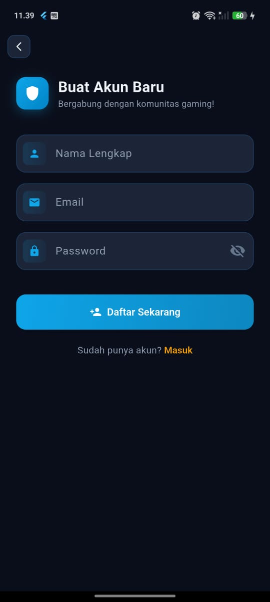
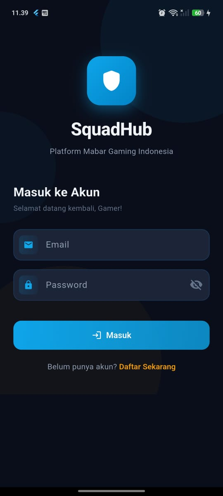

# SquadHub

SquadHub adalah aplikasi manajemen tim mabar (main bareng) berbasis Flutter yang dirancang khusus untuk komunitas gaming mobile seperti Mobile Legends, Free Fire, dan game sejenis.

## App Preview :

<p align="center">
   
   
</p>

## Gambaran Penggunaan

Dari sisi pengguna, SquadHub bekerja sederhana namun lengkap:

1. Pemain mendaftar dengan email dan password.
2. Pemain membuat jadwal mabar berisi tanggal, jam, game, dan anggota yang hadir.
3. Jadwal tersinkron realtime sehingga semua anggota tim melihat update yang sama.
4. Menjelang waktu mabar, anggota tim menerima notifikasi pengingat.
5. Setelah pertandingan, pemain dapat menyimpan momen kemenangan atau kekalahan dari kamera/galeri ke Log Aktivitas.
6. Pemain dapat menulis strategi pada Buku Catatan yang dapat dibuka kapan saja, termasuk saat offline.

## Kriteria Penilaian dan Fitur

| Kriteria | Fitur yang Menanggung |
|---|---|
| 1 - Firebase Auth | Login, Register, Logout |
| 2 - Firestore CRUD | Semua fitur Jadwal Mabar |
| 3 - Isar Local DB | Semua fitur Buku Catatan |
| 4 - image_picker | Upload screenshot di Log Aktivitas |
| 5 - FCM Notifikasi | Notif pengingat mabar |

## Strategi Penyimpanan Data

### Online (Firebase) vs Offline (Local)

| Fitur | Teknologi | Bisa Dilihat Orang Lain |
|---|---|---|
| Login / Register | Firebase Auth | Tidak relevan (data akun) |
| Jadwal Mabar | Firestore | Ya, data tim bersama |
| Buku Catatan | Isar (local) | Tidak, hanya di device sendiri |
| Log Aktivitas | In-memory + path file lokal | Tidak, hanya di device sendiri |
| Notifikasi | FCM + local notification | Ya, dapat dikirim lintas device |

## Aspek Implementasi

### 1. Firebase Authentication

- Data user yang disimpan: user yang mendaftar.
- Field utama: uid, email, displayName, createdAt.
- Alasan:
	- Login butuh verifikasi server.
	- Menyangkut keamanan akun.
	- Tidak tepat jika hanya disimpan lokal.

### 2. Firestore Collection: schedules

- Data yang disimpan: seluruh jadwal mabar tim.
- Field: game, description, dateTime, members, createdBy.
- Alasan memilih Firebase:
	- Jadwal dibuat satu anggota, harus terlihat semua anggota.
	- Butuh sinkronisasi realtime antar device.
	- Jika ada edit jadwal, seluruh anggota langsung melihat perubahan.
	- Ini shared data, jadi tidak cocok disimpan hanya lokal.

### 3. Isar Local DB: notes (Buku Catatan)

- Data yang disimpan: catatan strategi pribadi.
- Field: id, title, content, category, createdAt.
- Alasan memilih Isar local:
	- Catatan bersifat personal/draft.
	- Tetap bisa dipakai saat tidak ada koneksi internet.
	- Tidak perlu dibagikan ke anggota lain.
	- Akses harus instan.
	- Tetap tersedia meskipun layanan online bermasalah.

### 4. Data Sementara: match results

- Data yang disimpan: hasil pertandingan + screenshot.
- Field: id, status, imagePath, note, dateTime.
- Pendekatan saat ini:
	- File gambar disimpan di storage device.
	- Path gambar disimpan untuk ditampilkan ulang.
	- Data list aktivitas dikelola di memory selama app berjalan.
- Catatan pengembangan:
	- Untuk production, penyimpanan gambar bisa dipindah ke Firebase Storage.

## Visualisasi Keputusan Penyimpanan

```text
Perlu dilihat anggota lain?
|- YA  -> Firebase Firestore
|        contoh: jadwal mabar, profil tim, hasil turnamen bersama
|
`- TIDAK -> Perlu online?
					 |- YA  -> Firebase
					 |        contoh: backup catatan, sinkron antar perangkat sendiri
					 |
					 `- TIDAK -> Isar Local
											 contoh: draft catatan, setting preferensi, cache data
```

## Relasi Database

### Kenapa memenuhi kriteria relational database

| Konsep | Implementasi |
|---|---|
| Tabel 1 | NoteModel (catatan strategi) |
| Tabel 2 | NoteTagModel (hero terkait) |
| Relasi | noteId di NoteTagModel mengacu ke id di NoteModel |
| Jenis relasi | One-to-many (1 catatan, banyak tag) |
| CRUD relasi | Create tag, Read tag, Delete tag, Read by noteId |
| Cascade delete | Hapus catatan, semua tag terkait ikut dihapus |

## Ringkasan

SquadHub menggabungkan:

- Firebase Auth untuk otentikasi akun.
- Firestore untuk data jadwal tim yang harus realtime dan shared.
- Isar untuk catatan pribadi yang cepat dan offline-first.
- image_picker untuk input screenshot dari kamera/galeri.
- FCM dan local notification untuk pengingat mabar.

Dengan pendekatan ini, kebutuhan kolaborasi tim dan kebutuhan personal pemain dapat berjalan beriringan dalam satu aplikasi.

## Developer

`Dibuat oleh alvin zanua putra pada tahun 2026`

